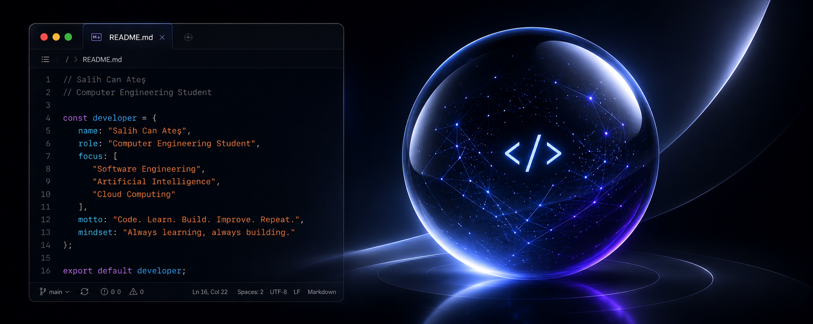

  

<h1 align="center">Hi, I'm Salih Can Ateş</h1>

Computer Engineering Student • Fırat University

Building software, learning continuously, and exploring AI technologies.

 

## About

I am a Computer Engineering student who enjoys learning new technologies, building meaningful projects, and continuously improving my software development skills.

Currently focusing on:

- Web Development
- Artificial Intelligence
- Cloud Technologies

 

## Featured Projects

### AI QR Menu

An AI-powered digital QR menu designed to provide intelligent recommendations and improve the restaurant experience.

### Zombie.exe

A 2D top-down survival game developed with Unity as part of my game development journey.

More projects coming soon.
## Technologies

`Java` • `JavaScript` • `TypeScript` • `React` • `Next.js` • `Node.js` • `Supabase` • `Git`

 

## Currently Learning

- Artificial Intelligence
- Next.js
- Cloud Technologies
